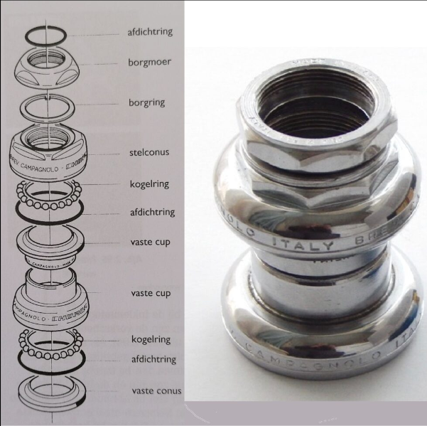
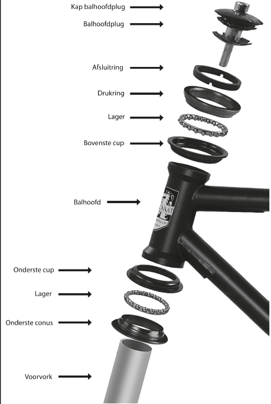
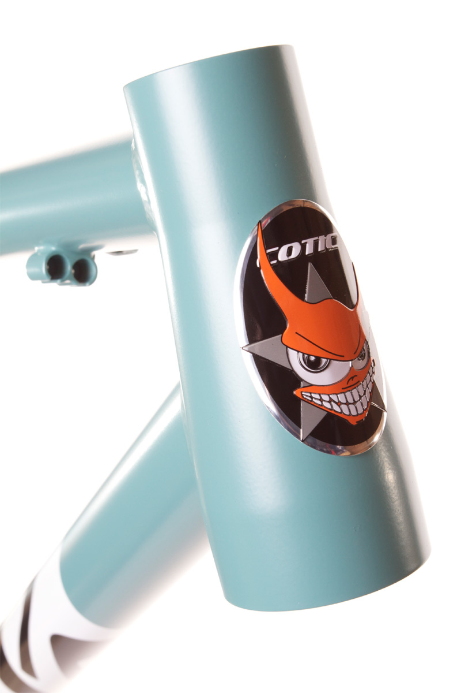
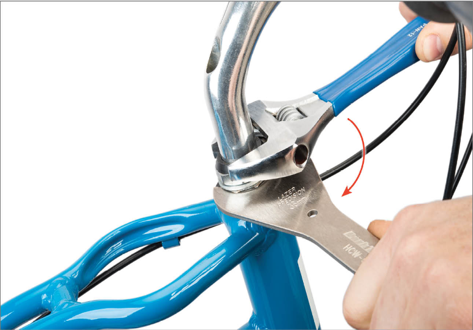

1. ToC
{:toc}

# Balhoofdstel
Het **balhoofd** is het cruciale draaimechanisme dat de voorvork met het frame verbindt, waardoor je het stuur soepel kan draaien en stabiliteit hebt. Het bestaat uit lagers (boven en 7
onder) in de balhoofdbuis en is essentieel voor het stuurgedrag. Belangrijke types zijn geïntegreerde/semi-geïntegreerde (Ahead) en klassieke balhoofdstellen.

## Types balhoofdstellen

**Klassieke balhoofdstellen** hebben zichtbare cups, vaak met schroefdraad.

{: style="width: 400px; display: block; margin: 0 auto;"}

*Klassiek balhoofdstel met schroefdraad*{:.image-caption}

Bij **semi-geïntegreerde balhoofdstellen** worden de cups in het frame geperst, lagers zitten grotendeels in de buis.

{: style="width: 400px; display: block; margin: 0 auto;"}

*Semi-geïntegreerd ahead balhoofdstel*{:.image-caption}

**Geïntegreerde balhoofdstellen** hebben lagers die direct in het frame vallen.

## Conische balhoofdbuis
Een **conische balhoofdbuis** of _tapered head tube_ is een balhoofdbuis van een fietsframe waarvan de diameter aan de onderkant groter is dan aan de bovenkant.. Voor een conische balhoofdbuis is een bijbehorend conisch balhoofdstel en een conische voorvork nodig. Deze onderdelen hebben een grotere onderdiameter (vaak 1,5 inch) en een kleinere bovendiameter (meestal 1 1/8 inch).

{: style="width: 200px;"}

# Handleidingen
## Balhoofdstel met schroefdraad afstellen

<iframe width="100%" height="450" src="https://www.youtube.com/embed/TOSBd_5HO64?start=213" title="Adjusting &amp; Troubleshooting Threaded Headsets" frameborder="0" allow="accelerometer; autoplay; clipboard-write; encrypted-media; gyroscope; picture-in-picture; web-share" referrerpolicy="strict-origin-when-cross-origin" allowfullscreen></iframe>

Balhoofdstellen met schroefdraad worden afgesteld met behulp van een bovenste borgmoer en een stelconus. De stuurpen heeft geen invloed op de lagerafstelling en hoeft niet gemonteerd te zijn om de lagers af te kunnen stellen.

Probeer de lagers zo los mogelijk af te stellen, maar zonder dat er speling of een bonkend gevoel merkbaar is. Om dit te bereiken, zorgt de onderstaande procedure er eerst voor dat er bewust speling in de afstelling ontstaat. Vervolgens draai je de conus stapsgewijs vaster totdat de speling volledig is verdwenen.

1. **Monteer het voorwiel**. Het voorwiel dient als hefboom om de stuurbuis op zijn plek te houden.

2. **Zorg dat de borgmoer van het balhoofd loszit**. Gebruik een balhooffsleutel om de stelconus tegen te houden.

3. **Draai de stelconus met de hand in wijzerzin** (met de klok mee) totdat deze de kogellagers raakt. Draai de conus vanaf dit punt minstens een 1/4 slag linksom (tegen de klok in). Houd de stelconus vast met de balhooffsleutel en draai de borgmoer stevig vast. Draai de borgmoer volledig aan.

    {: style="width: 400px; display: block; margin: 0 auto;"}

4. **Controleer op speling** door de voorrem in te knijpen en lichtjes het stuur naar voren en achteren te trekken. Draai de vork in verschillende richtingen terwijl je op speling controleert. In deze vroege fase _moet_ er speling aanwezig zijn. Als het balhoofd te strak aanvoelt, draai de afstelling dan verder los tot je duidelijk speling voelt.

5. **Klem het voorwiel tussen je knieën** en houd het in één lijn met de bovenbuis. De schroefdraadconus moet nu een klein stukje in wijzerzin worden bijgesteld. Gebruik een balhooffsleutel om de conus vast te houden en let goed op de positie van de sleutel ten opzichte van het voorwiel.

6. **Draai de borgmoer los** en draai de schroefdraadconus 1/16 tot 1/8 slag in wijzerzin ten opzichte van het wiel.

7. **Houd de schroefdraadconus stevig vast** met de sleutel en draai de borgmoer weer volledig vast. Controleer opnieuw op speling door de vork te draaien en deze in verschillende posities naar voren en naar achteren te bewegen.

8. **Herhaal stap 5 tot 7** totdat er geen speling meer is, maar het stuur nog steeds soepel draait. Het balhoofd moet nu correct zijn afgesteld.

## Balhoofdstel zonder schroefdraad afstellen

<iframe width="100%" height="450" src="https://www.youtube.com/embed/h2eURoPn7uU?start=34" title="Adjusting &amp; Troubleshooting Threadless Headsets" frameborder="0" allow="accelerometer; autoplay; clipboard-write; encrypted-media; gyroscope; picture-in-picture; web-share" referrerpolicy="strict-origin-when-cross-origin" allowfullscreen></iframe>

Balhoofden zonder schroefdraad werken volgens hetzelfde principe en hebben dezelfde afstelprocedure. De lagerringen moeten tegen de lagers drukken om speling te verwijderen.

De bout in de afdekkap (_top cap_) oefent druk uit op de stuurpen. De stuurpen drukt vervolgens op de spacers daaronder, en de spacers drukken weer op de lagerringen en de lagers. De klembouten van de stuurpen zetten de stuurpen daarna vast op de stuurbuis om de lagerafstelling te behouden en de stuurpen op zijn plek en uitgelijnd te houden.

{: .warning}
Als dit tijdens de montage nog niet is gebeurd, verwijder dan eerst de top cap om de ster (_starnut_) of de compressieplug in de stuurbuis te inspecteren. **Het balhoofd kan niet worden afgesteld als de top cap direct tegen de bovenkant van de stuurbuis drukt**. Voeg een extra spacer toe als de stuurbuis te lang is voor de huidige combinatie van stuurpen en spacers.

1. **Verwijder de bout van de top cap** om te controleren of de stuurbuis korter is dan de stuurpen/spacers (zodat de kap de stuurbuis niet raakt). Smeer de bout en monteer de kap en bout weer handvast. Draai de bout nog niet strak aan.

2. **Draai de stuurpenbout(en) los** waarmee de stuurpen aan de stuurbuis vastzit. Smeer deze bouten als ze droog zijn.

3. **Beweeg de stuurpen heen en weer** om te controleren of deze echt loszit. Als de stuurpen klem zit, verroest is of vastzit aan de stuurbuis, is afstelling onmogelijk.

4. **Lijn de stuurpen uit met het voorwiel** en draai de bout in de top cap voorzichtig aan. Stop zodra je weerstand voelt.

5. **Draai de stuurpenbouten tijdelijk vast** en controleer op speling door de vorkpoten naar voren en naar achteren te trekken. Draai het stuur in verschillende richtingen tijdens deze controle. In deze vroege fase kan er nog speling aanwezig zijn. Let op bij verende vorken: pak de vork aan het bovenste deel (de kroon of de binnenpoten) vast, aangezien de onderpoten speling kunnen hebben op de geleidebussen.

6. **Als er speling voelbaar is**, draai dan de stuurpenbouten weer los.

7. **Draai de afstelbout in de top cap** slechts een 1/8 tot 1/4 slag rechtsom (met de klok mee).

8. **Draai de stuurpenbouten weer vast** en controleer de vork opnieuw op speling.

9. **Herhaal de bovenstaande stappen totdat de speling volledig is verdwenen**. Vergeet niet om altijd eerst de stuurpenbouten los te draaien voordat je aan de afstelbout in de top cap draait.

10. **Controleer de definitieve uitlijning van de stuurpen met het voorwiel** en draai de klembouten van de stuurpen volledig vast met de momentsleutel.